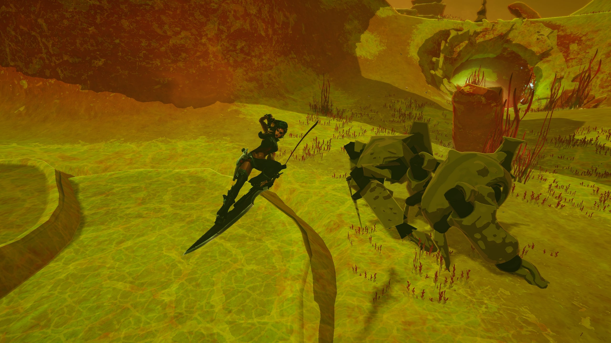
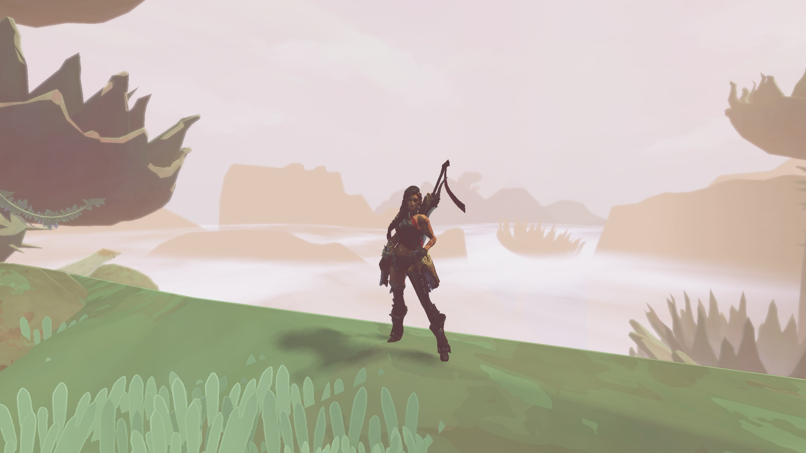
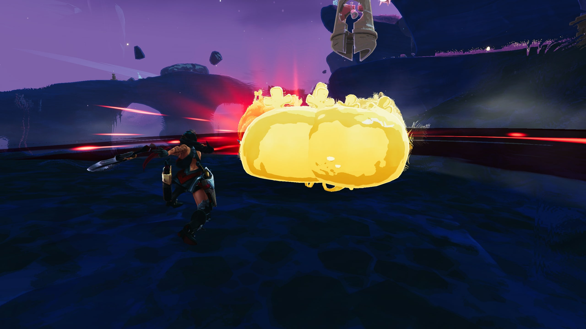
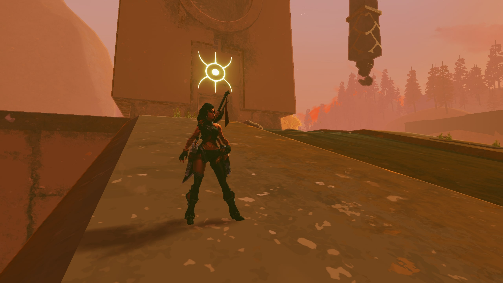
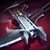

# Samira
### SamiraMod was created under Riot Games' "Legal Jibber Jabber" policy using assets owned by Riot Games.  Riot Games does not endorse or sponsor this project.

- Adds the champion Samira, from League of Legends, to Risk of Rain 2 as a survivor.

  

  
  

  
  

## Introduction
After her Shuriman home was destroyed as a child, Samira found her true calling in Noxus Crest icon Noxus, where she built a reputation as a stylish daredevil taking on dangerous missions of the highest caliber. Wielding black-powder pistols and a custom-engineered blade, Samira thrives in life-or-death circumstances, eliminating any who stand in her way with flash and flair.

## Samira's Base Stats
- Health: 110
- Health Regen: 1 / s
- Damage: 12
- Speed: 7 m/s
- Armor: 20

## Skills

| Skill             |                                                                        | Description                                                                                                                                                                                             | Stats                                  |
|:------------------|------------------------------------------------------------------------|---------------------------------------------------------------------------------------------------------------------------------------------------------------------------------------------------------|----------------------------------------|
| Daredevil Impulse |  | Samira's unique attacks generate a stack of Style for 6 seconds. For each stack, Samira gains bonus movement speed. At maximum stacks, Samira can cast Inferno Trigger.                                 | MS: `4%`/`8%`/`12%`/`16%`/`20%`/`25%`/ |
| Flair             |              | Samira fires a shot or swings her sword, dealing `130%` damage. Every 5 uses triggers a unique attack, dealing `40%` additional damage. Melee attacks deal `10%` more damage.                           | Proc: `1.0`                            |
| Blade Whirl       |        | Samira slashes around her for `0.5 seconds`, damaging enemies twice for `80%` damage, while destroying incoming projectiles.                                                                            | Proc: `1.0`, CD: `10 sec`              |
| Wild Rush         |          | Samira dashes forward slashing through any enemy in her path, dealing `70%` damage. She also gains `30%` Attack Speed for `3 seconds`. Getting a takedown against an enemy resets Wild Rush's cooldown. | CD: `6 sec`                            |
| Inferno Trigger   |   | Samira unleashes a torrent of shots for `3 seconds`, dealing `160%` damage. The number of shots fired is scaled with Attack Speed.                                                                      | CD: `7 sec`                            |

## Planned
- Better Multiplayer
- Skins
- Passive Implementation

## Special Thanks
- TheTimeSweeper - mod was built off of HenryTutorial
- Lemonlust - learned more about Risk of Rain 2 Modding through SettMod and JinxMod
- Risk of Rain 2 Modding Discord - lots of answers found here
- Family & friends - helped test the mod out

---

## Patch Notes

Patch 1.0.0
- Initial Release